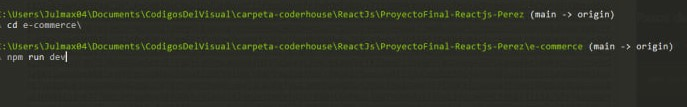

# THENORTHPOLE
-------------------------------------------------------------------------------------
Es un e-coomerce de mochilas para tus viajes , con un diseño simple claro y llamativo

### Pasos de instalación

Instalar los paquetes necesarios para correr la ***aplicación web***

```
npm install 
```
Luego dependencias y librerias necesarias para estilos y estructura
```
npm i bootstrap@5.3.2
npm install react-router-dom
npm install sweetalert2

```

*Una vez realizado estos pasos nos posicionamos en la carpeta donde contenemos el archivo package.json que estará dentro de la carpeta* ***e-commerce***

>[!IMPORTANT]
>
>Cada ruta será distinta desde donde se clone el repositorio

 
 
 *Por último corremos la aplicacion con el comando:*
 ```
 npm run dev
 ```
 
>[!VIDEO](/e-commerce/Gif/e-commerce%20-%20Brave%202024-02-03%2017-51-35.mp4)
